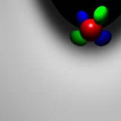
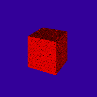
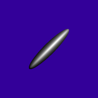
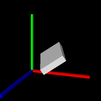
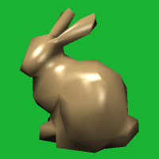
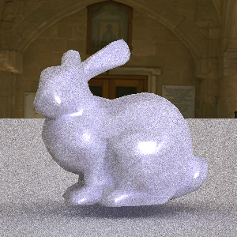
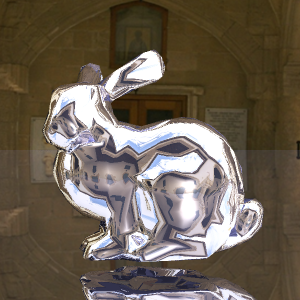
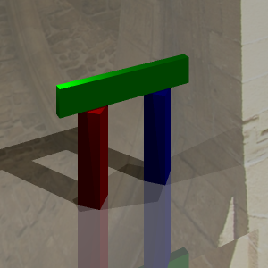

# Assignment 0

In this assignment, I used **OpenGL nodes** to:

- Change the color of the teapot
- Toggle the directional light on and off
- Move the point light

---

  

# Assignment 1

In this assignment, I implemented a **spline viewer** with advanced rendering features:

- **Tensor Product Patches**: Bezier and B-Spline surface rendering
- **Interactive Curve Controls**: Toggle between Bezier and B-Spline basis
- **Multiple 3D Models**: Teapot, spoon, teacup with different materials
- **Multi-Color Teapot Rendering**: Color assignment based on Z-coordinate analysis and made colorful teaset!

---

  
 
 

# Assignment 2

In this assignment, I implemented a **hierarchical modeling and skeletal animation system** with smooth skinning deformation:

- **Hierarchical Skeleton Modeling**: Joint-based character rigging with parent-child relationships
- **Smooth Skinning Deformation (SSD)**: Skinned mesh deformation that follows bone transformations
- **Interactive Joint Controls**: Real-time pose manipulation through UI sliders for each joint
- **Dual-Character System**: Two independent skeletal characters displayed side-by-side with separate pose controls

---

  

# Assignment 3

In this assignment, I implemented a **physically-based simulation system** with multiple particle systems and numerical integration:

- **Spring System**: Simple harmonic oscillator with particle-spring dynamics
- **Rotating Pendulum**: Multi-particle chain pendulum with realistic physics simulation
- **Cloth Mesh Simulation**: Deformable cloth mesh with spring-mass system and wind effects
- **Numerical Integration**: Implemented Euler, Trapezoidal, and RK4 integrators for stable simulation
- **Wind System**: Realistic varying wind forces with directional visualization

---

  

# Assignment 4

In this assignment, I implemented a **ray tracer** with Phong shading, recursive reflections, and several advanced rendering features:

## Core Features
- **Phong Lighting Model**: Ambient, diffuse, and specular shading with point and directional lights
- **Primitive Intersection**: Sphere, Plane, and Triangle primitives with barycentric coordinate interpolation
- **Transform Nodes**: Support for translated, rotated, and scaled objects via scene graph
- **Recursive Reflections**: Specular reflections with configurable bounce depth
- **Shadow Rays**: Visibility testing between surface points and light sources

## Extra Features

### 1. Super Sampling Anti-Aliasing
Implements pixel-level supersampling with configurable samples per dimension and filter types (Box and Tent filters) to reduce aliasing artifacts.

### 2. Glossy Reflection
Monte Carlo integration for glossy reflections using roughness parameter and per-pixel seeded random sampling for smooth, realistic material appearance.

### 3. Normal Mapping
Tangent-space normal mapping for surface detail using TBN matrix transformation, interpolating texture coordinates via barycentric coordinates.

### 4. Spiral Camera Effect
Artistic camera that rotates rays around the optical axis based on horizontal position, creating a vortex effect.

---

  
  
  

  
  
  

  
  

**Image Descriptions:**
- **01_spiral.png**: Demonstrates the **Spiral Camera Effect** - rays are twisted around the optical axis creating a vortex visual effect
- **02_bump.png**: Shows **Normal Mapping** applied to the cube, adding surface detail without geometric complexity
- **03_supersampling.png**: Sphere rendered with **Supersampling Anti-Aliasing** for smoother edges
- **04_supersampling.png**: Axes scene with **Supersampling AA** reducing aliasing artifacts
- **05_supersampling.png**: Low-poly bunny with **Supersampling AA** for improved edge quality
- **06_glossy.png**: Demonstrates **Glossy Reflection** on the mirror bunny material with roughness=0.25, showing realistic reflective surface appearance
- **06_supersampling.png**: High-poly bunny with **Supersampling AA** combined with reflections
- **07_supersampling.png**: Arch scene with **Supersampling AA**, shadows, and reflections
