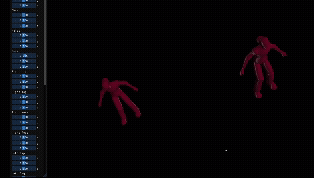
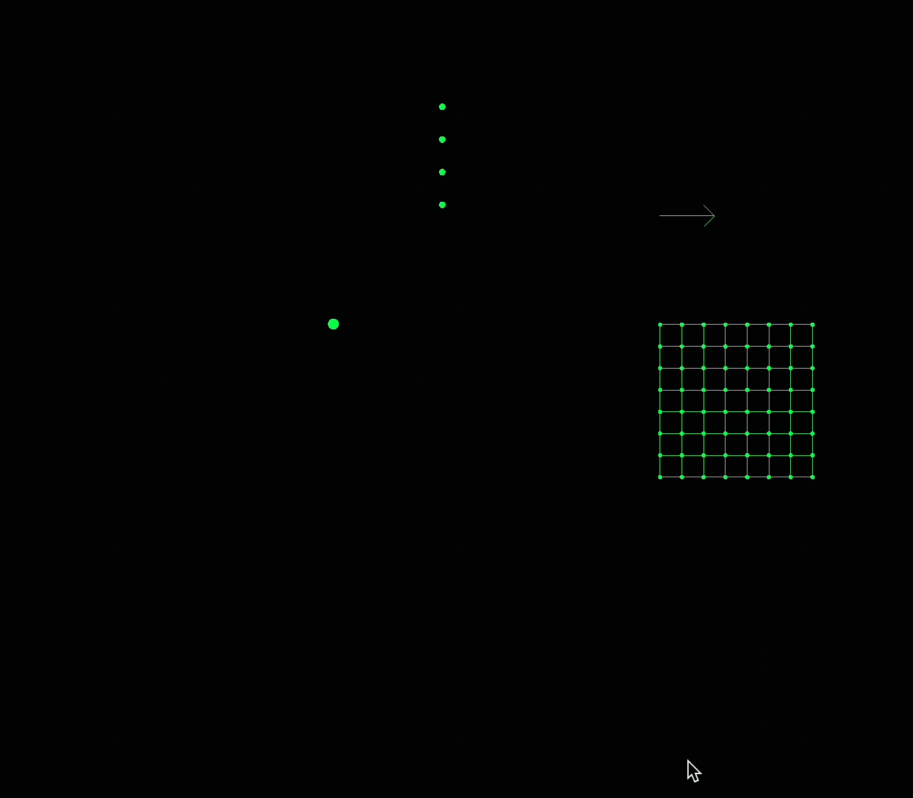

# Assignment 0

In this assignment, I used **OpenGL nodes** to:

- Change the color of the teapot
- Toggle the directional light on and off
- Move the point light

---

  

# Assignment 1

In this assignment, I implemented a **spline viewer** with advanced rendering features:

- **Tensor Product Patches**: Bezier and B-Spline surface rendering
- **Interactive Curve Controls**: Toggle between Bezier and B-Spline basis
- **Multiple 3D Models**: Teapot, spoon, teacup with different materials
- **Multi-Color Teapot Rendering**: Color assignment based on Z-coordinate analysis and made colorful teaset!

---

  
 
 

# Assignment 2

In this assignment, I implemented a **hierarchical modeling and skeletal animation system** with smooth skinning deformation:

- **Hierarchical Skeleton Modeling**: Joint-based character rigging with parent-child relationships
- **Smooth Skinning Deformation (SSD)**: Skinned mesh deformation that follows bone transformations
- **Interactive Joint Controls**: Real-time pose manipulation through UI sliders for each joint
- **Dual-Character System**: Two independent skeletal characters displayed side-by-side with separate pose controls

---

  

# Assignment 3

In this assignment, I implemented a **physically-based simulation system** with multiple particle systems and numerical integration:

- **Spring System**: Simple harmonic oscillator with particle-spring dynamics
- **Rotating Pendulum**: Multi-particle chain pendulum with realistic physics simulation
- **Cloth Mesh Simulation**: Deformable cloth mesh with spring-mass system and wind effects
- **Numerical Integration**: Implemented Euler, Trapezoidal, and RK4 integrators for stable simulation
- **Wind System**: Realistic varying wind forces with directional visualization

---

  

